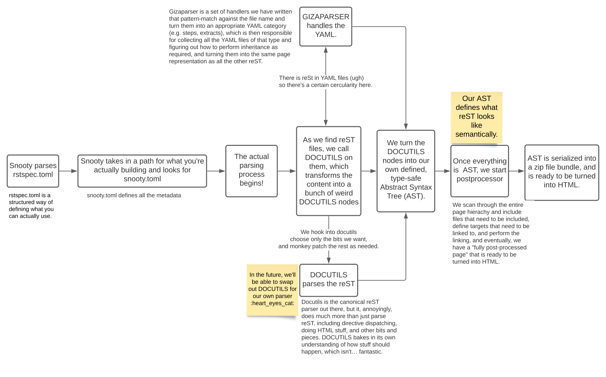

# Snooty Parser



## Organization

The snooty parser has the following key parts:

* Drivers
  * `main.py`
  * `language_server.py`
* Parser
  * `parser.py`
  * `rstparser.py`
  * `gizaparser/`
* Types & Tools
  * `flutter.py`
  * `types.py`
  * `util.py`

### Drivers

Snooty *drivers* instantiate a parser and use it to interact with
input reStructuredText and YAML files, and to create output artifacts and
report diagnostics.

These drivers instantiate a `parser.Project` object.

#### `main.py`

`main.py` defines the main command-line Snooty interface. See CLI usage at head of file.

#### `language_server.py`

`language_server.py` defines a
[Language Server](https://microsoft.github.io/language-server-protocol/specification)
for use with IDEs such as Visual Studio Code.

### Parser

The `parser.Project` class is the main driver-agnostic interface to
Snooty. It reads a `snooty.toml` file to configure the project, and
parses each file with `rstparser.Parser`. The general expected format of
the parsed directory is as follows:
```
reStructuredText directory
┣snooty.toml
┣source
┃ ┗images
┃   ┗image files here
┃ ┗includes
┃   ┗fact-some-content.rst
┃ ┗page-name
┃   ┗sub-page-name.txt
┃ ┗index.txt
┃ ┗page-name.txt
```

`rstparser.Parser` is responsible for transforming input reStructuredText artifacts
(.rst & .txt) into our JSON AST format. It instantiates a visitor object
(unnecessarily parameterized; it's always `parser.JSONVisitor`); creates
a docutils parser; passes the markup into it; and uses the visitor to
create the AST. The parent `parser.Project` then calls the configured
callbacks to notify the backend of the parsed page.

The parser transforms Giza-style YAML files using the `gizaparser`
package. This uses the `flutter` library to deserialize the YAML files
into Python classes, and check types to ensure there are no errors.

#### `rstparser.py`

`docutils`-interfacing components of the parser.

#### `gizaparser/`

Each module in this package contains the infrastructure to parse a category
of Giza YAML file. The `gizaparser.nodes` module contains generally-applicable
helper classes.

### Types & Tools

#### `flutter.py`

Tool to load arbitrary JSON/YAML/TOML data into a class and report schema violations.

#### `types.py`

Definitions of high level configuration components that make up the parser, ie. ProjectConfig

#### `n.py`

Node type definitions that the parser generates for front end consumption.

#### `util.py`

Helper functions to help the Parser in navigating through the reStructuredText. Also includes helper global classes ie. logger and cacher

## Developing Snooty

1. Install [Poetry](https://python-poetry.org/docs/)

2. Set up the project's dependencies.

   ```shell
   poetry install
   ```

3. Make your changes to the source code.

4. Run `make test` and `make format ` to check that the tests pass and fix your formatting. This will also install the prerequirements defined in pyproject.toml.

5. You can activate a shell where the `snooty` command is available by running:

   ```shell
   poetry shell

   snooty build <docs_property_path>
   ```

### Running tests

To run tests for a specific file:

```shell
poetry run pytest snooty/test_<file>.py
```

### Code Coverage

Install [Coverage](https://coverage.readthedocs.io/). After running tests via `make format test`, run:

```shell
coverage html
```

This will generate an HTML representation of code coverage throughout the repo that can be viewed in the browser.

### Formatting

To run all linting, use `make lint`. To format source code, use `make format`.

## Release Process

### Releasing

To release snooty, do the following:

1. Make sure you are on the `main` branch.

2. Ensure that the "Unreleased" section of CHANGELOG.md is up-to-date and
   commit any changes you've made.

3. Run `make cut-release BUMP_TO_VERSION=<new_version>`.

   The new version number should follow [semantic versioning](https://semver.org):
   `MAJOR.MINOR.PATCH`. For example, `make cut-release BUMP_TO_VERSION=0.1.2`.
   Refer to `snooty/__init__.py` for the current version number.

   This will create commit(s) that update the version across changelogs and project config files [example](https://github.com/mongodb/snooty-parser/commit/7a7137d18dc691ea946d09b5f4659869dbfc70f9)

   This will also create a new tag named `v<new_version>` and push it to your origin,
   causing Github Actions to trigger the release process. After several minutes
   (you can monitor its progress at <https://github.com/mongodb/snooty-parser/actions>),
   a new release should be created with binaries for supported platforms.

   You can instruct the `cut-release` target to avoid pushing the tag by passing the
   `PUSH_TO=""` option. For example, `make cut-release BUMP_TO_VERSION=0.1.2 PUSH_TO=""`.

4. Push your branch.

5. Go to <https://github.com/mongodb/snooty-parser/releases/> to locate the newly-created
   release.

6. Copy the appropriate section from CHANGELOG.md into the release description,
   check the _This is a pre-release_ checkbox, and create the release.

If there is an error, use `git reset --hard <previous_commit_hash>` to revert any
commits that might have been made, and
`git tag --delete v<version>; git push --delete origin v<version>` to remove the
tag if it was created.

## Problem Areas

* Transforming docutils nodes into our AST (parser.JSONVisitor) is
  currently a wretched mess.
* Flutter is currently a fork to add support for line numbers. We need to
  figure out a cleaner way of doing this so we can merge it into the
  upstream codebase.

## Glossary

<dl>
  <dt>reStructuredText</dt>
  <dd>A markup language identified with the Python ecosystem.</dd>

  <dt>Abstract Syntax Tree (AST)</dt>
  <dd>A tree of nodes which reflect the syntactic structure of an unparsed textual document.</dd>

  <dt>Postprocessor</dt>
  <dd>The component of snooty which performs global link analysis and other forms of processing that spans multiple files.</dd>

  <dt>docutils</dt>
  <dd>The canonical parsing library for reStructuredText.</dd>

  <dt>tinydocutils</dt>
  <dd>Our vendored fork of docutils, modified to be statically typed and less reliant on method dispatch through string manipulation.</dd>

  <dt>Giza</dt>
  <dd>The primary entry point of the docs' original tech stack: it would download assets, generate reStructuredText from YAML files (hence the `gizaparser/` directory for compatibility), and invoke Sphinx.</dd>

  <dt>Sphinx</dt>
  <dd>The primary unofficially official documentation toolchain for reStructuredText.</dd>

  <dt>Project</dt>
  <dd>A directory with a `snooty.toml` file and a source directory containing reStructuredText source files.
  A project typically corresponds to a distinct site.</dd>

  <dt>Page</dt>
  <dd>A page is a full self-contained document, typically corresponding to a `.txt` file.</dd>

  <dt>Include</dt>
  <dd>A document fragment meant to be included in a Page or in other include files. Typically these are created
  by `.rst` or giza `.yaml` files.</dd>

  <dt>Intersphinx</dt>
  <dd>A protocol by which project data can be shared with other projects. This data is encoded in an `objects.inv` file, and facilitates cross-project links.</dd>
</dl>
